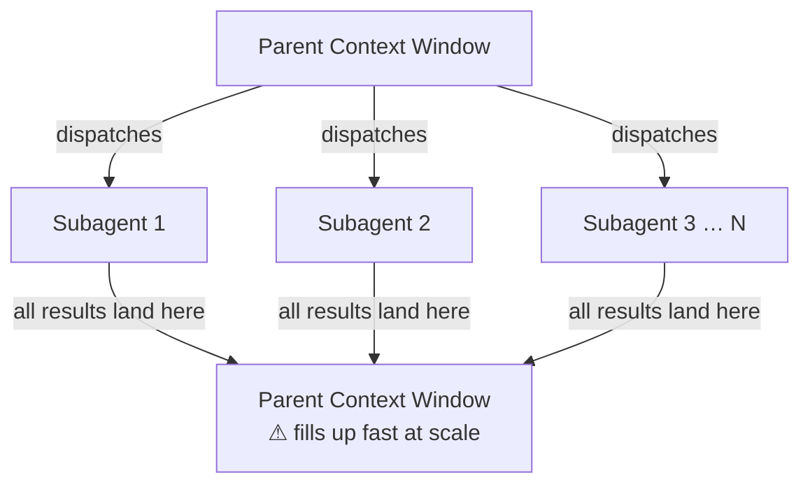
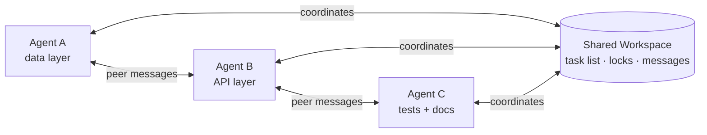
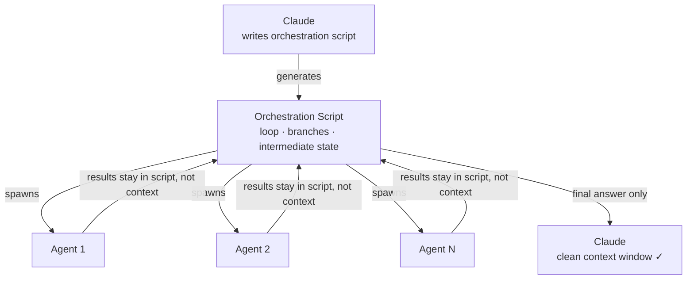

Claude Code has three ways to run work at scale: subagents, agent teams, and dynamic workflows. Most guides treat them as a spectrum from simple to complex. That framing is wrong, and it leads to reaching for the wrong primitive — usually subagents when you need a workflow, or agent teams when a single subagent would do.

The real axis isn't complexity. It's **where intermediate results live**, and that decision shapes your context window budget, your coordination overhead, and whether the thing you built can run again tomorrow without you babysitting it.

Here's what each primitive actually does, what breaks when you pick wrong, and the three questions that narrow the choice.

---

## The three tools, briefly

**[Subagents](https://dev.to/bredmond1019/multi-agent-orchestration-running-10-claude-instances-in-parallel-part-3-29da)** (via the `Task` tool) spawn a separate Claude instance for a bounded task. The parent agent dispatches work, the subagent runs in isolation, and the result comes back into the parent's context window. You can fan out several subagents in parallel. The parent sees every result.

**[Agent teams](https://www.claudio-novaglio.com/en/papers/agent-teams-claude-code-multi-agent-orchestration)** (launched February 2026) are a flat group of Claude instances working from shared state. Instead of a parent collecting results, teammates coordinate through a shared task list with dependency tracking, peer-to-peer messaging, and file locking to prevent conflicts. No single Claude is "in charge" — the team is the orchestrator.

**[Dynamic workflows](https://code.claude.com/docs/en/workflows)** (research preview, May 2026) take a different approach entirely. Claude writes a JavaScript orchestration script, and *that script* runs the agents. The parent context window sees only the final verified answer — not the intermediate results, not the coordination noise. The script itself holds the loop, branching logic, and intermediate state.

The primitives aren't interchangeable. They solve different problems.

---

## The problem with defaulting to subagents

Subagents are the natural first reach, and they work well at small scale. The failure mode is subtle: they work until they don't, and by then your context window is already gone.

Here's a concrete example. Suppose you're analyzing 50 files for security vulnerabilities. You fan out 50 subagents, each scanning one file and returning findings. If each result is 4K tokens, you've just pushed 200K tokens into the parent context — and you haven't synthesized anything yet. Scale that to 100 agents and you're at 400K tokens of intermediate results before a single useful sentence goes to the user.

The context window becomes a landfill for orchestration exhaust.



This isn't a bug in how you used subagents — it's the wrong primitive for the job. Subagents are designed for 1–5 parallel tasks where each result is directly useful *in the current conversation*. The pattern breaks the moment results are inputs to a next step rather than final answers.

---

## When agent teams are the right model

Agent teams fit problems that look like real sprint work: a feature that has a data layer, an API layer, tests, and docs, all of which need to be written in parallel without stepping on each other.

The coordination primitives teams add — shared task list, peer messaging, file locking — are exactly what prevents two agents from writing conflicting migrations or overwriting each other's test fixtures. Without them, parallel subagents working on related files will race.



A [documented example](https://claudefa.st/blog/guide/agents/agent-patterns): 12 Claude agents rebuilt an entire frontend in one shot, with one agent refactoring components, one writing tests, one updating documentation, and one optimizing performance. The result was a pull request with 10,000+ coordinated lines of changes. That's not something you'd want in a parent context window.

Use agent teams when:
- Work naturally decomposes into parallel workstreams that touch shared files
- Agents need to know what other agents are doing mid-task
- The decomposition is known upfront

The gap agent teams don't cover: you can't save the team's execution as a script and rerun it next week. Every run is a fresh orchestration, guided by Claude's judgment in the moment.

---

## When dynamic workflows solve the problem

Dynamic workflows flip the model. Claude writes a JS orchestration script that *you* can read, save, and rerun. The script holds the loop, conditionals, and waiting logic. Claude's context window only receives the final output — not the 400K tokens of intermediate noise.



```javascript
// Simplified example of what a generated workflow script looks like
import { runAgent } from "@anthropic/claude-code-workflows";

const files = await glob("src/**/*.ts");

const results = await Promise.all(
  files.map(file =>
    runAgent({
      task: `Security audit ${file}. Return JSON: {file, findings[]}`,
      context: [file],
    })
  )
);

const summary = await runAgent({
  task: "Synthesize these audit results into a prioritized report",
  context: [JSON.stringify(results)],
});

console.log(summary);
```

The script runs the agents. The orchestration logic is in code, not in Claude's context. You can rerun it in CI tomorrow.

The [Bun rewrite](https://claude.com/blog/introducing-dynamic-workflows-in-claude-code) is the stress test case here. Jarred Sumner used dynamic workflows to port ~750,000 lines of Zig to Rust in 11 days, ending with 99.8% of the existing test suite passing. That's not exploratory AI work — it's a deterministic job at a scale where a context-window-based orchestrator would have collapsed under its own weight.

Use dynamic workflows when:
- The task is too large for a single context window
- You don't know the decomposition strategy until you've started (the workflow script figures it out)
- You need the result to be rerunnable and auditable
- Result quality matters more than token economy

---

## The three-question decision framework

Before picking a primitive, answer these:

**1. Do I know how to split the work before I start?**
- Yes, and it's 1–5 tasks → **subagents**
- Yes, and it involves parallel workstreams on shared files → **agent team**
- No — the split strategy emerges as work progresses → **dynamic workflow**

**2. Do intermediate results need to inform each other in real time?**
- No — each result is independent → **subagents** or **workflow**
- Yes — agents need to react to what other agents found → **agent team**

**3. Do I need to run this again?**
- No, one-off task → **subagents** or **agent team**
- Yes, repeatable job or CI integration → **dynamic workflow**

If you hit "dynamic workflow" on any of the three questions, that's probably your answer. The other two primitives optimize for convenience at the cost of reusability.

---

## Takeaways

The three primitives share one goal — do more work than fits in a single Claude context window — but they differ on who holds the orchestration state:

- **Subagents**: the parent context window holds everything. Simple, direct, breaks at scale.
- **Agent teams**: a shared workspace holds coordination state. Right for parallel feature work on shared files.
- **Dynamic workflows**: a script holds orchestration logic. Right for large jobs that need to be auditable and rerunnable.

If you're hitting context window limits with subagents, don't reach for more parallel agents — reach for a different primitive. The scaling problem is almost always architectural, not a tuning problem.

The Claude Code docs on [dynamic workflows](https://code.claude.com/docs/en/workflows) are worth reading alongside the [Bun rewrite announcement](https://claude.com/blog/introducing-dynamic-workflows-in-claude-code) to see what this looks like at real scale.
